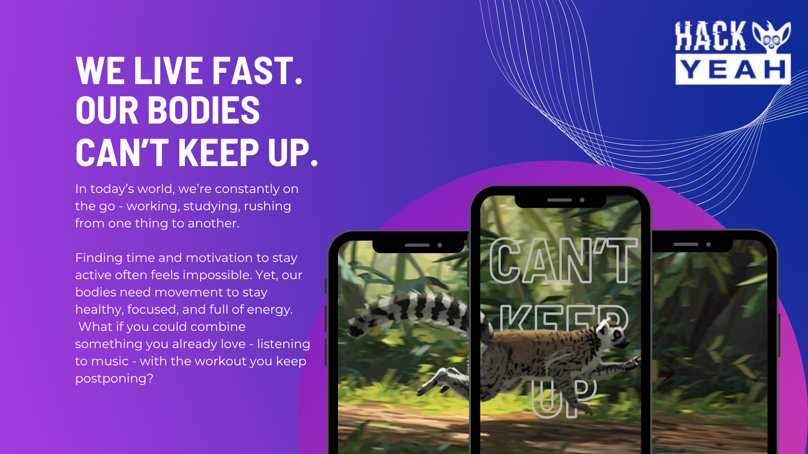
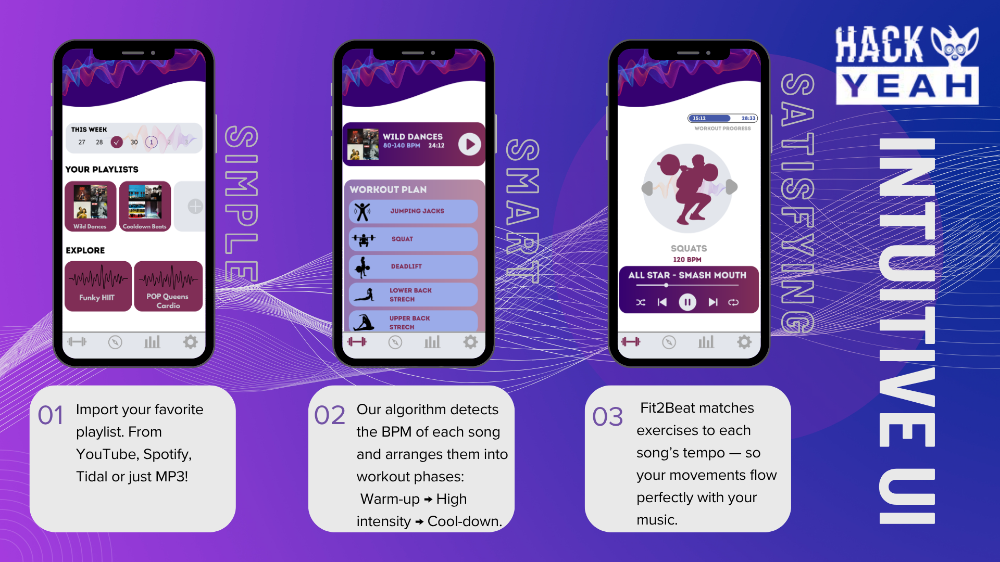
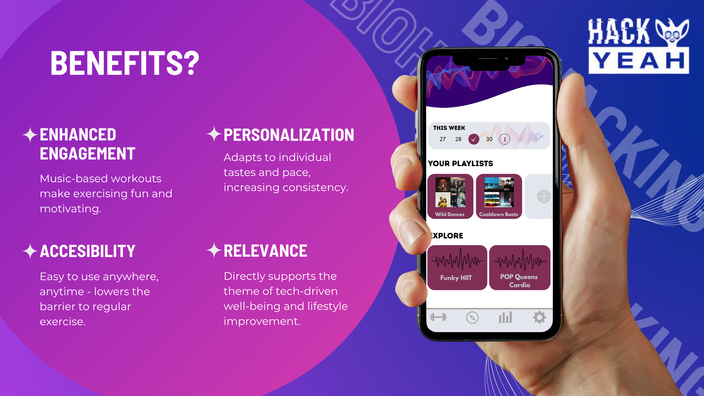
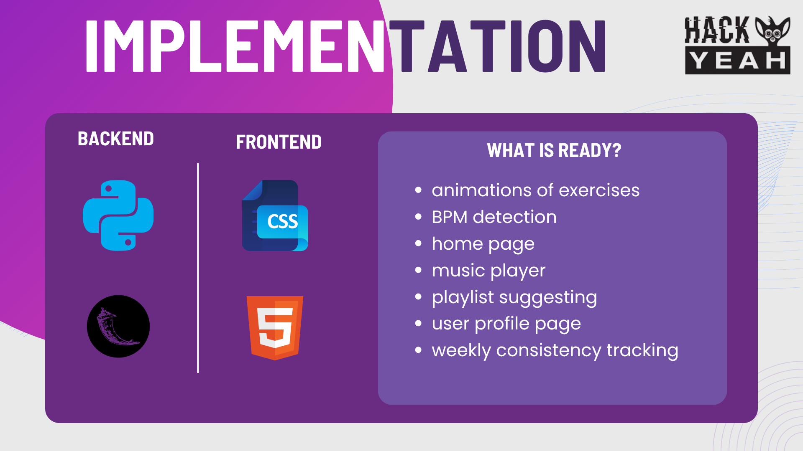

# Fit2Beat
Do you want to hit the gym, but don't like music that apps provide with exercises? 

Fit2Beat works other way around! 

Provide your playlists, and our app will create personalized training which fits perfectly your music taste! 

[App link](https://fit2beat.toadres.pl)

## 📽️ Presentation
(technical info below)










## 💻 Technologies

- Python 🐍
- Flask 🌶️
- HTML / CSS 🌐

to run just clone repo and run:
```bash
pip install -r requirements.txt
```
make sure You have ffmpeg installed:
```bash
sudo apt update
sudo apt install ffmpeg
```
then just
```bash
flask run
```

## ❗Important
App has been developed for phones, and doesn't really support horizontal resolutions

## Results 
We scored 3.9/5! As first-time hackathon participants, we're proud of ourselves!

## 📬 Authors
Created by [Natalia Dybczak](https://github.com/nataliadybczak), [Jagoda Flejmer](https://github.com/jFlamer), [Martyna Gaj](https://github.com/margaj366) and [Jakub Kierznowski](https://github.com/qualv13) for hackathon "HackYeah 2025" in Cracow
